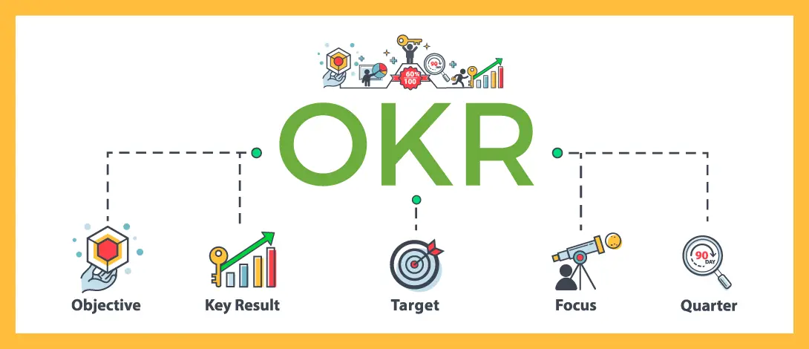

- Mission -> Vision -> Strategy -> Objectives -> Key Results
- 
- OKR 是一个从个人愿景到设定个人目标的方法论，它能帮助组织成员/使用者聚焦最重要的事。OKR 是确保将整个组织/个人的力量都聚焦于完成对所有人/个人都同样重要的事项的一套管理方法。正是多了 Objectives，才能让参与者先思考最重要的事，然后再去拆解任务。而 KPI 却是直接确定任务。