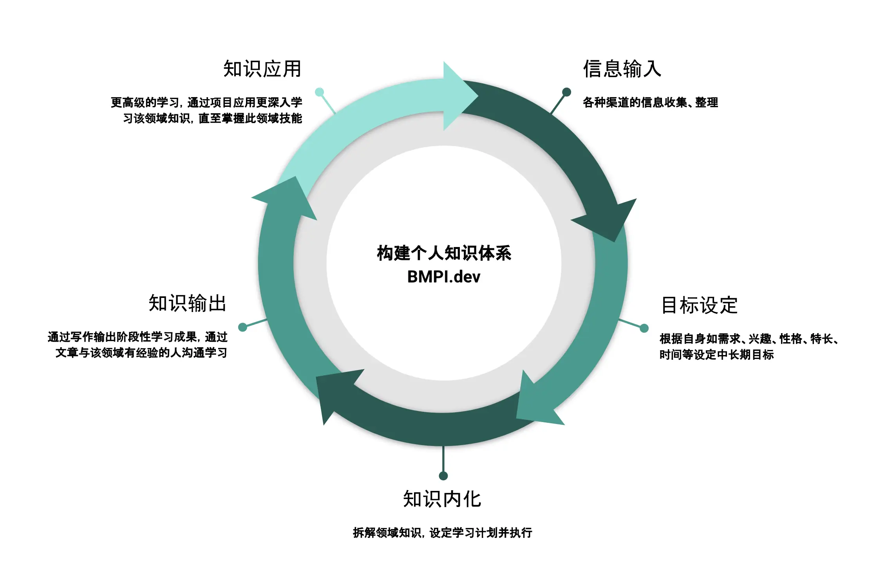

- # 人生愿景
	- 认知升级：不断学习去升级认知，做更好的自己；
	- 长期主义：做有长期收益的事情，比如写作与投资；
		- 人的精力有限，不希望我的时间全部耗费在短期收益的事情
	- 积极分享：分享个人经验积极影响他人。
		- 分享能给我带来一定的社交品牌效果，让我获取更多高质量的社交机会
- # 建立个人知识体系
	- 总纲： 构建闭环的学习流程，帮助我们自我提升。可分成哪5个阶段？ #card
		- 
	- ## 1. 信息输入
	  每天都有大量的信息输入，现代社会不缺优质信息，缺的是如何找到优质信息。
		- 如何找到优质的信息渠道？ #card
			- 通过==信任链传播==算法，构建自己的高质量的信息渠道。
		- 信息输入的渠道
			- 微信公众号
				- 准备一些高质量公众号的列表作为初始的关注列表 ( 可通过阅读它们的文章来判断 ) ，逐渐收集这些公众号推荐的其他公众号。
				- 可使用==微信读书==订阅，有新的文章会自动提醒。
			-
			-
	- ## 2. 目标设定
	- ## 3. 知识内化
	- ## 4. 知识输出
	- ## 5. 知识应用
	-
- # 学习闭环
	- ## 学习闭环4个环节 #card
	  card-last-interval:: 4
	  card-repeats:: 1
	  card-ease-factor:: 2.6
	  card-next-schedule:: 2022-01-06T08:34:22.392Z
	  card-last-reviewed:: 2022-01-02T08:34:22.392Z
	  card-last-score:: 5
		- 学习
		- 思考
		- 记录
		- 复习
	- 关键因素
		- 影响一个人的学习能力的最重要因素是什么？ #card
		  card-last-interval:: 4
		  card-repeats:: 1
		  card-ease-factor:: 2.6
		  card-next-schedule:: 2022-01-06T08:35:24.886Z
		  card-last-reviewed:: 2022-01-02T08:35:24.886Z
		  card-last-score:: 5
			- 他已经知道了什么； 已有知识
		- 如何扩充已有知识？ #card
		  card-last-interval:: 4
		  card-repeats:: 1
		  card-ease-factor:: 2.6
		  card-next-schedule:: 2022-01-06T08:34:37.376Z
		  card-last-reviewed:: 2022-01-02T08:34:37.376Z
		  card-last-score:: 5
			- 必须复习巩固, 把你学的知识留下来
		- 记忆的手段有那些？ #card
		  card-last-interval:: 4
		  card-repeats:: 1
		  card-ease-factor:: 2.6
		  card-next-schedule:: 2022-01-06T08:35:41.806Z
		  card-last-reviewed:: 2022-01-02T08:35:41.806Z
		  card-last-score:: 5
			- 背诵  ---》 机械学习
			- 联系
			- 联想
			- 组块
			- 比喻
			- 谐音
		- 钉钉子的精神？ #card
		  card-last-interval:: 4
		  card-repeats:: 1
		  card-ease-factor:: 2.6
		  card-next-schedule:: 2022-01-06T08:35:13.302Z
		  card-last-reviewed:: 2022-01-02T08:35:13.302Z
		  card-last-score:: 5
			- 钉钉子往往不是一锤子就能钉好的，而是要一锤一锤接着敲，可能钉歪，可不断调整，把钉子钉直。
			- 不是一蹴而就的
	- ## 记笔记如何闭环? #card
	  card-last-interval:: 4
	  card-repeats:: 1
	  card-ease-factor:: 2.6
	  card-next-schedule:: 2022-01-06T08:34:56.856Z
	  card-last-reviewed:: 2022-01-02T08:34:56.856Z
	  card-last-score:: 5
		- 第一级书名，第二级章名，第三级小节名，第四级问题， 第五级答案。
	- ## 参考资料
		- https://www.bilibili.com/video/BV1Df4y1P7PA?p=2&spm_id_from=pageDriver
		-
- # 规划
	- 收集工具： 印象笔记
	- 分析工具：XMind
	-
- # 输入
-