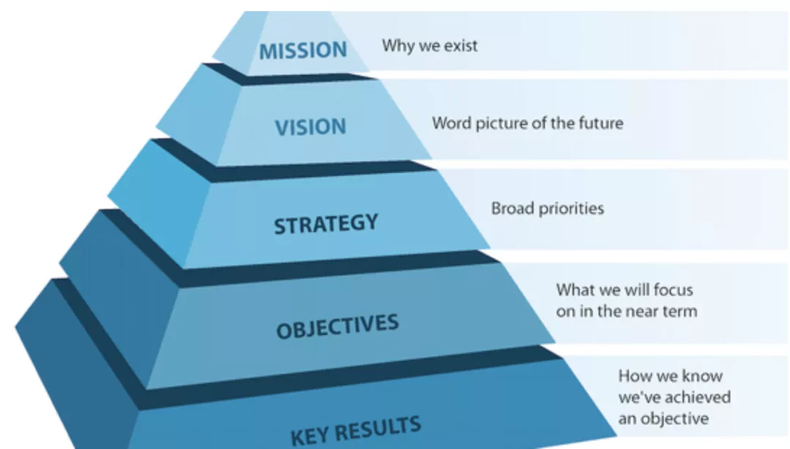

- 哪些常见问题？
	- 我们习惯于做眼前能看到的事情。
		- 但这些事情是不是重要的？
		- 它们和我们的愿景用什么关系？
	- 如何评估我们做的项目怎么样？我们离目标远了还是近了？
	- 如何让团队伙伴们理解日常说做具体事情的意义？
- OKR是什么？ #card
	- ==确保==将整个组织的力量都==聚焦==于完成对==所有人==都==同样====重要==的事项的一套管理方法。
- [[重要]]
	- 强迫我们停下来想清楚，对我们来说重要的事情是什么
	- Mission -> Vision -> Strategy -> Objectives -> Key Results
		- 
	- 一个企业，从使命、愿景，到战略拆解，最后到 OKR 执行。以终为始，层层递进，从诗和远方到眼前的苟且，确保我们始终在做最重要的事。
		- 使命很重要，可以让企业的伙伴和用户们，明白我们长期做的是一件什么事情，但是我们无法直接对着使命工作。
		- 战略(Strategy)拆解。把这个遥远的使命拆解为几年内最重要的事。但这个依然没法指导我们手头的工作。
		- OKR的作用，就是做在战略拆解的下一步，用每个季度的机会，去重新review战略。
	- 如何定义重要？谁说了算呢？
		- 员工对不确定世界的预判能力差别很大，企业家的超额利润都来自识别任用判断力更优的员工
		- 企业能不能活下去，是否具有超额利润，取决于决策质量，取决于判断力更优的员工。
		- 这个员工是谁呢？是老板本人或者是管理层吗？
			- 在不同的时代背景下，这个答案也是不同的。
				- 企业家通常掌握更多的信息，世界也是线性变化的，因此他们可以根据供给、需求、产能，做出最佳的判断。
					- 他们清楚地知道自己希望员工做什么，关键问题是需要一种制度和手段，检查员工们是否用最佳、最经济的方式做到。---》 KPI
				- 随着人类进入到创新时代，面临的情况就很不一样了。
					- 即使企业家本人通常拥有更多的洞察，但他依然不掌握全部信息。而且上面那种自上而下的方式，会导致企业的调整和掉头非常困难。
		- 解决方案： OKR
			- 需要一种管理工具，能充分发挥每个人的能力和责任感，建立共同的愿景和努力方向，协调个人和共同目标和谐一致.
	- 把这个团队塑造成一个人。最终让这个人：
		- 拥有这个团队最广、最深的认知，既包括对行业多年的实践和洞察，也包括一手的来自用户的需求，还包括不同背景的伙伴身上独特的认知；
		- 在这些信息的基础上，大到战略推演、小到产品细节，让这个虚拟的人来做出当下看来最佳的决策。
- ## 参考资料
	- [找到最重要的事](https://mp.weixin.qq.com/s/1T8r7HIX8NAQqUowFOV0rg)
	-
	-
	-