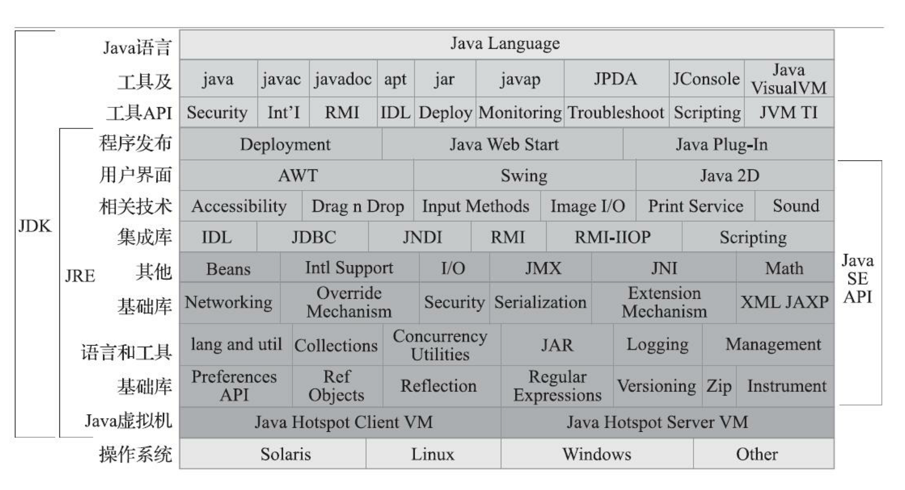
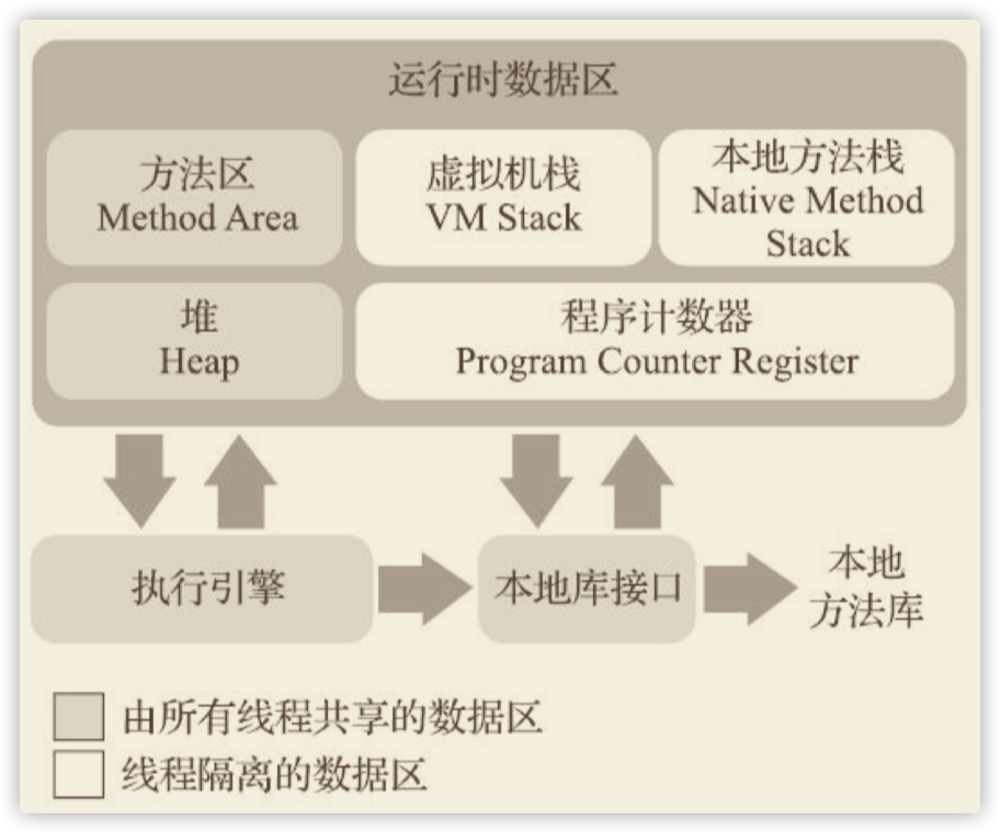

- type:: book
  tags:: book
  author:: 
  status::
  topic::
  score::
  summary::
- 电子书
	- 
- # 第1章　近Java
  collapsed:: true
  在虚拟机层面隐藏了底层技术的复杂性以及机器与操作系统的差异性。运行程序的物理机千差万别，而Java虚拟机则在千差万别的物理机上面建立了统一的运行平台，实现了在任意一台Java虚拟机上编译的程序，都能在任何其他Java虚拟机上正常运行。这一极大的优势使得Java应用的开发比传统C/C++应用的开发更高效快捷，程序员可以把主要精力放在具体业务逻辑，而不是放在保障物理硬件的兼容性上。
	- ## 1.1 概述 
	  collapsed:: true
	  Java不仅仅是一门编程语言，它还是一个由一系列计算机软件和规范组成的技术体系，这个技术体系提供了完整的用于软件开发和跨平台部署的支持环境，并广泛应用于嵌入式系统、移动终端、企 业服务器、大型机等多种场合。
		- 优点：
		  1. 一次编译，到处运行
		  2. 内存管理，避免内存泄露和指针越界
		  3. 完善的应用程序接口
		  4. 有无数第三方类库
		  5. 热点代码检测和即时编译及优化
	- ## 1.2　Java技术体系 
	  collapsed:: true
	  技术体系包含以下部分
		- [[Java]]程序设计语言
		- 各种硬件平台上的[[Java虚拟机]]实现
		- [[Java Class文件格式]]
		- Java类库API
		- 第三方类库
		- 
	- ## 1.3　Java发展史 4
	- ## 1.4　Java虚拟机家族 12
	  collapsed:: true
		- ### 1.4.1　虚拟机始祖：Sun Classic/Exact VM 12
		- ### 1.4.2　武林盟主：HotSpot VM 13
		- ### 1.4.3　小家碧玉：Mobile/Embedded VM 14
		- ### 1.4.4　天下第二：BEA JRockit/IBM J9 VM 15
		- ### 1.4.5　软硬合璧：BEA Liquid VM/Azul VM 16
		- ### 1.4.6　挑战者：Apache Harmony/Google Android Dalvik VM 17
		- ### 1.4.7　没有成功，但并非失败：Microsoft JVM及其他 18
		- ### 1.4.8　百家争鸣 19
	- ## 1.5　展望Java技术的未来 21
	  collapsed:: true
		- ### 1.5.1　无语言倾向 21
		  [[Graal VM]]
		- ### 1.5.2　新一代即时编译器 23
		  Java的劣势：
		  1. 内存占用（JRE)
		  2. 启动时间较长
		  
		  [[Substrate VM]] 极小型运行时环境。
		- ### 1.5.3　向Native迈进 24
		- ### 1.5.4　灵活的胖子 26
		- ### 1.5.5　语言语法持续增强 27
	- ## 1.6　实战：自己编译JDK 29
	  collapsed:: true
		- ### 1.6.1　获取源码 29
		- ### 1.6.2　系统需求 31
		- ### 1.6.3　构建编译环境 33
		- ### 1.6.4　进行编译 34
		- ### 1.6.5　在IDE工具中进行源码调试 36
	- ## 1.7　本章小结 39
	-
- # 第2章　Java内存区域与内存溢出异常
	- ## 2.1　概述 42
	  Java程序员把控制内存的权力交给了Java虚拟机，一旦出现内存泄漏和溢出方面的问 题，如果不了解虚拟机是怎样使用内存的，那排查错误、修正问题将会成为一项异常艰难的工作。
	- ## 2.2　运行时数据区域 42
	  
		- ### 2.2.1　程序计数器
		  是当前线程所执行的字节码的行号指示器。它是程序控制流的指示器，分支、循环、跳转、异常处 理、线程恢复等基础功能都需要依赖这个计数器来完成。
		  
		  每条线程都需要有一个独立的程序计数器，各条线程 之间计数器互不影响，独立存储，我们称这类内存区域为“线程私有”的内存。
		- ### 2.2.2　Java虚拟机栈
		  线程私有。
		  
		  每个方法被执行的时候，java虚拟机会同步创建一个帧栈。用于存储局部变量表， 操作数表， 动态链接， 方法出口等信息 。
		  
		  每个方法被调用直至执行完毕的过程，就对应一个帧栈在虚拟机栈中从入栈到出栈的过程。
		  
		  如果线程请求的栈深度大于虚拟机所允许的深度，将抛出StackOverflowError异常。若java虚拟机栈容器可以动态扩展，但栈扩展无法申请足够的内存会抛出OutOfMemoryError异常。
		- ### 2.2.3　本地方法栈
		  本地方法栈（Native Method Stacks）与虚拟机栈所发挥的作用是非常相似的。
		  其区别只是虚拟机 栈为虚拟机执行Java方法（也就是字节码）服务，而本地方法栈则是为虚拟机使用到的本地（Native） 方法服务。
		- ### 2.2.4　Java堆
		  线程共享。
		  Java堆（Java Heap）是虚拟机所管理的内存中最大的一块。，Java 世界里“几乎”所有的对象实例都在这里分配内存。
		  Java堆是垃圾收集器管理的内存区域，又称GC堆。 现代垃圾收集器大部分都是基于分代收集理论设计的，所以Java堆中经常会出现“新生代”“老年代”“永久代”“Eden空间”“From Survivor空间”“To Survivor空间”等名词，
		  
		  Java虚拟机都是按照可扩 展来实现的（通过参数-Xmx和-Xms设定）。如果在Java堆中没有内存完成实例分配，并且堆也无法再 扩展时，Java虚拟机将会抛出OutOfMemoryError异常。
		- ### 2.2.5　方法区
		  线程共享。
		  存储已被虚拟机加载 的类型信息、常量、静态变量、即时编译器编译后的代码缓存等数据。
		  并非数据进入了方法区就如永久代的名字一样“永久”存在了。这区域的内存回 收目标主要是针对常量池的回收和对类型的卸载，一般来说这个区域的回收效果比较难令人满意，尤 其是类型的卸载，条件相当苛刻，但是这部分区域的回收有时又确实是必要的。
			- ### 2.2.6　运行时常量池
			  运行时常量池（Runtime Constant Pool）是方法区的一部分。Class文件中除了有类的版本、字 段、方法、接口等描述信息外，还有一项信息是常量池表（Constant Pool Table），用于存放编译期生 成的各种字面量与符号引用，这部分内容将在类加载后存放到方法区的运行时常量池中。
		- ### 2.2.7　直接内存
		  直接内存（Direct Memory）并不是虚拟机运行时数据区的一部分。
		  引入了一种基于通道（Channel）与缓冲区 （Buffer）的I/O方式，它可以使用Native函数库直接分配堆外内存，然后通过一个存储在Java堆里面的 DirectByteBuffer对象作为这块内存的引用进行操作。这样能在一些场景中显著提高性能，因为避免了 在Java堆和Native堆中来回复制数据。
	- ## 2.3　HotSpot虚拟机对象探秘 48
	  collapsed:: true
		- ### 2.3.1　对象的创建 48
		  当Java虚拟机遇到一条字节码new指令时:
		  1. 将去检查这个指令的参数是否能在常量池中定位到 一个类的符号引用，并且检查这个符号引用代表的类是否已被加载、解析和初始化过。
			- 如果没有，那 必须先执行相应的类加载过程
			  2. 虚拟机将为新生对象分配内存。等同于把一块确定 大小的内存块从Java堆中划分出来。
			- 分配内存就仅仅是把那 个指针向空闲空间方向挪动一段与对象大小相等的距离，这种分配方式称为“指针碰撞”（Bump The Pointer）
			- 虚拟机就必须维护一个列表，记录上哪些内存块是可用的，在分 配的时候从列表中找到一块足够大的空间划分给对象实例，并更新列表上的记录，这种分配方式称 为“空闲列表”（Free List）
			- 线程安全：
				- 虚拟机是采用CAS配上失败重试的方式保证更新操作的原子性
				- 每个线程在Java堆中预先分配一小块内存，称为本地线程分配缓冲（Thread Local Allocation Buffer，TLAB）
				  3. 将分配到的内存空间（但不包括对象头）都初始化为零值，
				  4. 对象的对象头（Object Header）：
				  5. 设置对象的对象头（Object Header）： 是哪个类的实例；如何才能找到类的元信息；对象的哈希码；
		- ### 2.3.2　对象的内存布局 51
		- ### 2.3.3　对象的访问定位 52
	- ## 2.4　实战：OutOfMemoryError异常 53
	- ### 2.4.1　Java堆溢出 54
	- ### 2.4.2　虚拟机栈和本地方法栈溢出 56
	- ### 2.4.3　方法区和运行时常量池溢出 61
	- ### 2.4.4　本机直接内存溢出 65
	- ## 2.5　本章小结 66
- # 第3章　垃圾收集器与内存分配策略
  collapsed:: true
	- ## 3.1　概述 67
	- ## 3.2　对象已死？ 68
	  collapsed:: true
		- ### 3.2.1　引用计数算法 68
		- ### 3.2.2　可达性分析算法 70
		- ### 3.2.3　再谈引用 71
		- ### 3.2.4　生存还是死亡？ 72
		- ### 3.2.5　回收方法区 74
	- ## 3.3　垃圾收集算法 75
	  collapsed:: true
		- ### 3.3.1　分代收集理论 75
		- ### 3.3.2　标记-清除算法 77
		- ### 3.3.3　标记-复制算法 78
		- ### 3.3.4　标记-整理算法 79
	- ## 3.4　HotSpot的算法细节实现 81
	  collapsed:: true
		- ### 3.4.1　根节点枚举 81
		- ### 3.4.2　安全点 82
		- ### 3.4.3　安全区域 83
		- ### 3.4.4　记忆集与卡表 84
		- ### 3.4.5　写屏障 85
		- ### 3.4.6　并发的可达性分析 87
	- ## 3.5　经典垃圾收集器 89
	  collapsed:: true
		- ### 3.5.1　Serial收集器 90
		- ### 3.5.2　ParNew收集器 92
		- ### 3.5.3　Parallel Scavenge收集器 93
		- ### 3.5.4　Serial Old收集器 94
		- ### 3.5.5　Parallel Old收集器 95
		- ### 3.5.6　CMS收集器 96
		- ### 3.5.7　Garbage First收集器 98
	- ## 3.6　低延迟垃圾收集器 104
	  collapsed:: true
		- ### 3.6.1　Shenandoah收集器 105
		- ### 3.6.2　ZGC收集器 112
	- ## 3.7　选择合适的垃圾收集器 121
	  collapsed:: true
		- ### 3.7.1　Epsilon收集器 121
		- ### 3.7.2　收集器的权衡 121
		- ### 3.7.3　虚拟机及垃圾收集器日志 122
		- ### 3.7.4　垃圾收集器参数总结 127
	- ## 3.8　实战：内存分配与回收策略 129
	  collapsed:: true
		- ### 3.8.1　对象优先在Eden分配 130
		- ### 3.8.2　大对象直接进入老年代 131
		- ### 3.8.3　长期存活的对象将进入老年代 132
		- ### 3.8.4　动态对象年龄判定 134
		- ### 3.8.5　空间分配担保 135
	- ## 3.9　本章小结 137
- # 第4章　虚拟机性能监控-故障处理工具
  collapsed:: true
	- ## 4.1　概述 138
	- ## 4.2　基础故障处理工具 138
	  collapsed:: true
		- ### 4.2.1　jps：虚拟机进程状况工具 141
		- ### 4.2.2　jstat：虚拟机统计信息监视工具 142
		- ### 4.2.3　jinfo：Java配置信息工具 143
		- ### 4.2.4　jmap：Java内存映像工具 144
		- ### 4.2.5　jhat：虚拟机堆转储快照分析工具 145
		- ### 4.2.6　jstack：Java堆栈跟踪工具 146
		- ### 4.2.7　基础工具总结 148
	- ## 4.3　可视化故障处理工具 151
	  collapsed:: true
		- ### 4.3.1　JHSDB：基于服务性代理的调试工具 152
		- ### 4.3.2　JConsole：Java监视与管理控制台 157
		- ### 4.3.3　VisualVM：多合-故障处理工具 164
		- ### 4.3.4　Java Mission Control：可持续在线的监控工具 171
	- ## 4.4　HotSpot虚拟机插件及工具 175
	- ## 4.5　本章小结 180
- # 第5章　调优案例分析与实战
  collapsed:: true
	- ## 5.1　概述 181
	- ## 5.2　案例分析 181
	  collapsed:: true
		- ### 5.2.1　大内存硬件上的程序部署策略 182
		- ### 5.2.2　集群间同步导致的内存溢出 184
		- ### 5.2.3　堆外内存导致的溢出错误 185
		- ### 5.2.4　外部命令导致系统缓慢 187
		- ### 5.2.5　服务器虚拟机进程崩溃 187
		- ### 5.2.6　不恰当数据结构导致内存占用过大 188
		- ### 5.2.7　由Windows虚拟内存导致的长时间停顿 189
		- ### 5.2.8　由安全点导致长时间停顿 190
	- ## 5.3　实战：Eclipse运行速度调优 192
	  collapsed:: true
		- ### 5.3.1　调优前的程序运行状态 193
		- ### 5.3.2　升级JDK版本的性能变化及兼容问题 196
		- ### 5.3.3　编译时间和类加载时间的优化 200
		- ### 5.3.4　调整内存设置控制垃圾收集频率 203
		- ### 5.3.5　选择收集器降低延迟 206
	- ## 5.4　本章小结 209